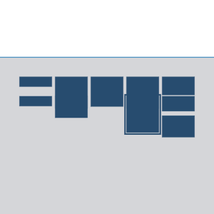

# Pipeline de Control de Calidad, Ensamblado De Novo y Caracterización Genómica (Nanopore)

##  Descripción del Proyecto
Pipeline bioinformático reproducible desarrollado en la plataforma **Galaxy** para el procesamiento integral de lecturas largas (long reads) provenientes de secuenciación con **Oxford Nanopore Technologies (ONT)**. 

El flujo de trabajo realiza el control de calidad inicial, filtrado por longitud y calidad, ensamblado de novo del genoma, visualización del grafo de ensamblado, evaluación métrica de contigs e identificación taxonómica/secuencial mediante alineamiento local.

---

##  Diagrama del Pipeline

---

##  Arquitectura y Etapas del Workflow

| Etapa | Herramienta | Versión | Función / Parámetros clave |
| :--- | :--- | :--- | :--- |
| **0. Input Data** | *Data Input* | — | Ingesta de lecturas Nanopore comprimidas (`seq_mis_nano.fastq.bz2`). |
| **1. QC Inicial** | **NanoPlot** | `1.47.0` | Inspección de perfiles de calidad Phred, longitud de lecturas y cálculo de N50 previo al filtrado. |
| **2. Descompresión** | **BZ2 Converter**| `1.0.1` | Descompresión del dataset de entrada a formato estándar FASTQ Sanger. |
| **3. Filtrado** | **Filtlong** | `0.3.1` | Limpieza de secuencias: descarte de lecturas cortas (`min_length: 700 bp`) ponderando calidad media de bases y tamaño de ventana (`window_size: 250`). |
| **4. QC Posterior** | **NanoPlot** | `1.47.0` | Validación del enriquecimiento de lecturas de alta calidad y confirmación de remoción de ruido. |
| **5. Ensamblado De Novo** | **Flye** | `2.9.6` | Ensamblado de genoma/contigs optimizado para lecturas Nanopore (`--nano-corr`, 1 iteración). |
| **6. Inspección de Grafo** | **Bandage** | `2022.09` | Visualización estructural del grafo de ensamblado a partir del formato `.gfa`. |
| **7. Validación Métrica** | **QUAST** | `5.3.0` | Evaluación estadística del ensamblado (N50, L50, GC%, distribución de longitud de contigs). |
| **8. Anotación / Búsqueda** | **NCBI BLAST+ (blastn)**| `2.16.0` | Alineamiento de nucleótidos del consenso contra base de referencia mitocondrial (`refseq_mitochondrion`) con un umbral $e\text{-value} \le 0.001$. |

---

##  Archivos del Repositorio

- `workflow/`: Contiene la definición exportada del pipeline (`Mini_Proyecto--Analisis_genomico.ga`) lista para importar.
- `img/`: Captura del lienzo del flujo (`workflow_preview.png`).
- `reports/`: *(Opcional)* Reportes descargados de NanoPlot, QUAST e imágenes de Bandage.

---

## Reproducibilidad en Galaxy

Para ejecutar este flujo de trabajo:

1. Cloná o descargá el archivo `.ga` ubicado en la carpeta `workflow/`.
2. Accedé a tu instancia de [Galaxy](https://usegalaxy.eu).
3. Dirigite a la pestaña **Workflow** en el menú superior y hacé clic en **Import**.
4. Cargá el archivo `.ga`.
5. Ejecutá el pipeline suministrando las lecturas FASTQ correspondientes como entrada del nodo 0.
